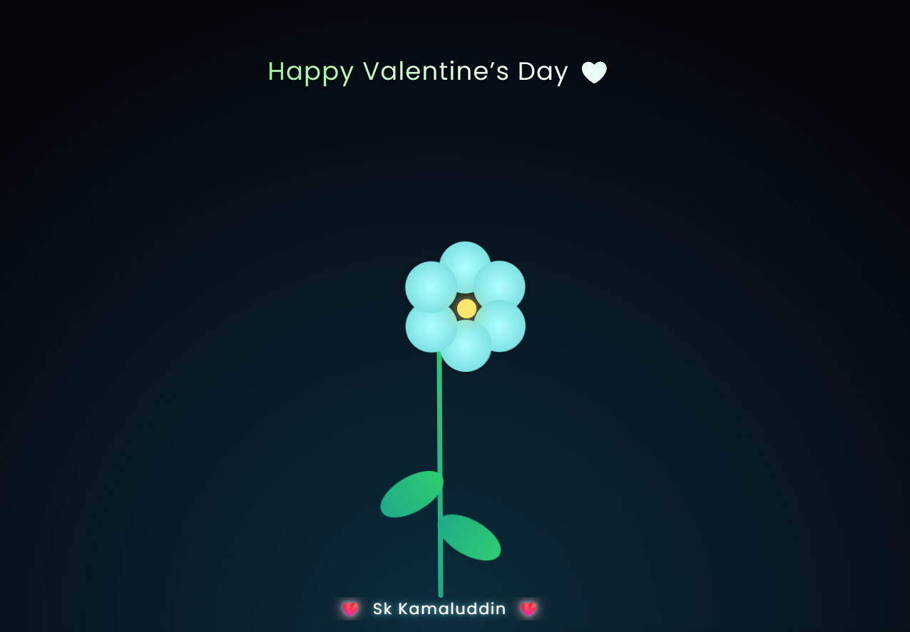

# 🌸 Valentine Flower Animation

A Reels-style smooth flower animation built using pure **HTML & CSS**.  
The flower grows gently from the bottom, blooms beautifully, and sways softly — perfect for Valentine’s Day or aesthetic UI demos.

---

## ✨ Features

-  Flower grows smoothly from the bottom  
-  Blooming petals animation  
-  Natural left-right sway motion  
-  Gradient shine text  
-  Name animation with glow & typewriter effect  
-  Mobile-friendly & Reel screen-record ready  
-  No JavaScript — only HTML & CSS

---

##  Built With

- HTML5  
- CSS3 (Animations, Keyframes, Gradients)

---

##  Live Demo

👉 https://kamalcodezen.github.io/flower-animation-repo/

---

##  About

Reels-style animated flower built with pure HTML & CSS.  
Smooth grow, bloom, and sway animation — designed by **Sk Kamaluddin**.

---

## 🏷️ Topics

html css animation flower reels ui

---

⭐ If you like this project, don’t forget to **star the repo**!
